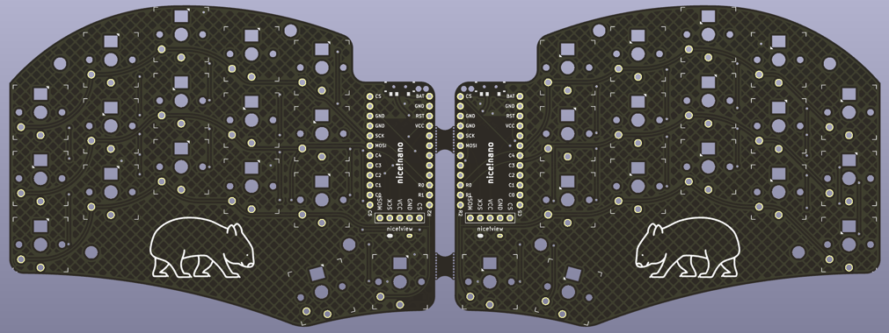
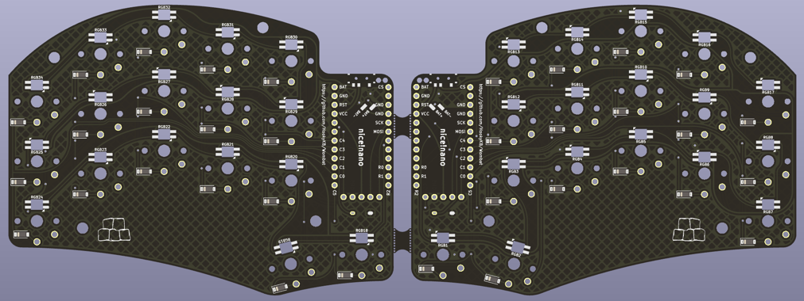

# Wombat is a 34 key split keyboard

Modelled on the [Ferris](https://github.com/pierrechevalier83/ferris)/[sweep](https://github.com/davidphilipbarr/Sweep), with some tweaks.

### Main features

1. Choc spaced, preped for milmax hotswap,
2. SK6812 mini-e per key RGB,
3. [nice!nano](https://nicekeyboards.com/nice-nano) + [nice!view](https://nicekeyboards.com/nice-view),
4. full power switch + RGB power switch stacked under the n!n USB-C,
5. opposite fan direction for the (2) thumb cluster,
6. it has a [wombat](https://en.wikipedia.org/wiki/Wombat) picture on it. 🎉

